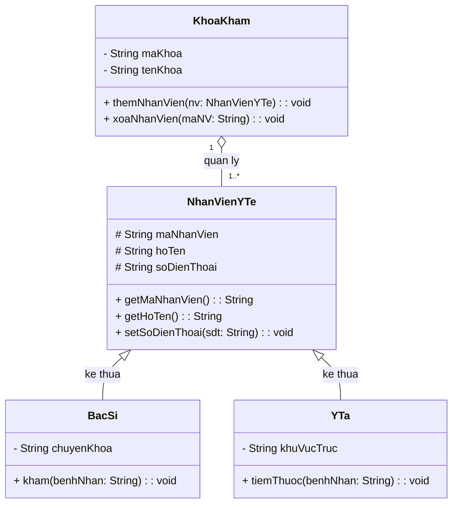

# BÁO CÁO PHÂN TÍCH LỖI THIẾT KẾ VÀ TÁI CẤU TRÚC CLASS DIAGRAM HỆ THỐNG RIKKEICARE

> 👤 **Học viên:** Đỗ Hoàng Sơn | **Mã SV:** PTIT-HCM-066
> 🏫 **Môn học:** IT105-K25-Phan-tich-thi-t-k-h-th-ng

---

## 📊 Sơ đồ thiết kế hệ thống (Class Diagram)

> 💡 *Sơ đồ dưới đây được render tự động trực tiếp trên GitHub bằng Mermaid. Bạn cũng có thể tải file **`bt2.drawio`** trong repository này để mở và chỉnh sửa trực tiếp trên [Draw.io (diagrams.net)](https://app.diagrams.net).* 

---

## Nhiệm vụ 1: Soi lỗi thiết kế và Phân tích hậu quả (Bước 1)

Qua quan sát bản thiết kế ban đầu của lập trình viên Junior, hai lớp 'BacSi' và 'YTa' đang mắc lỗi thiết kế trùng lặp dữ liệu (Redundancy Code Smell), vi phạm trực tiếp nguyên tắc DRY (Don't Repeat Yourself) trong lập trình hướng đối tượng.

Phân tích cụ thể về thuộc tính trùng lặp và hậu quả vận hành hệ thống được trình bày chi tiết dưới đây.

- Các thuộc tính bị khai báo trùng lặp ở cả 2 lớp bao gồm: 'maNhanVien', 'hoTen', 'soDienThoai'.
- Hậu quả trực tiếp: Khi hệ thống cần sửa đổi cấu trúc hoặc ràng buộc của thuộc tính 'hoTen' (ví dụ: tách thành 'ho' và 'ten', đổi kiểu dữ liệu, hoặc thêm kiểm tra độ dài), nhà phát triển phải thực hiện chỉnh sửa thủ công ở tất cả các lớp liên quan, dẫn đến tốn thời gian, nguy cơ bỏ sót cao và gây mất đồng bộ dữ liệu trên toàn hệ thống.

## Nhiệm vụ 2: Tái cấu trúc bằng cơ chế Kế thừa - Inheritance (Bước 2)

Để giải quyết triệt để lỗi trùng lặp thuộc tính, giải pháp refactoring chuẩn xác là áp dụng kỹ thuật Gom nhóm (Generalization). Chúng ta trích xuất các thuộc tính chung vào một lớp cha (Superclass) tên là 'NhanVienYTe', sau đó cho 'BacSi' và 'YTa' kế thừa lại.

Bảng tổng hợp kết quả tái cấu trúc danh mục thuộc tính được thiết lập như sau:

| Lớp cha (Superclass) | Lớp con (Subclass) | Thuộc tính dùng chung (của Lớp cha) | Thuộc tính riêng biệt (của Lớp con) |
| --- | --- | --- | --- |
| NhanVienYTe | BacSi | maNhanVien, hoTen, soDienThoai | chuyenKhoa |
| NhanVienYTe | YTa | maNhanVien, hoTen, soDienThoai | khuVucTruc |

## Nhiệm vụ 3: Thiết lập quan hệ Tổng hợp Aggregation (Bước 3)

Trong bối cảnh quản lý nhân sự tại bệnh viện RikkeiCare, mối quan hệ giữa 'KhoaKham' (Khoa khám bệnh) và 'NhanVienYTe' (Nhân viên y tế) đòi hỏi sự linh hoạt về mặt vòng đời đối tượng.

Đề bài xác định: Một khoa khám bệnh bao gồm nhiều nhân viên y tế, nhưng khi khoa giải thể, các nhân viên này không bị xóa khỏi hệ thống mà vẫn tồn tại độc lập để chuyển sang khoa khác hoặc chờ phân công mới.

- Loại quan hệ: Quan hệ Tổng hợp (Aggregation). Ký hiệu trên sơ đồ là đường nối với hình thoi rỗng (Unfilled Diamond) nằm về phía lớp chủ thể 'KhoaKham'.
- Bội số quan hệ (Multiplicity): 1 - 1..* (Một 'KhoaKham' có từ 1 đến nhiều 'NhanVienYTe'). Phía 'KhoaKham' mang bội số 1, phía 'NhanVienYTe' mang bội số 1..* (hoặc *).
- Ý nghĩa thiết kế: Quan hệ Aggregation thể hiện tính liên kết yếu (weak coupling). Vòng đời của đối tượng 'NhanVienYTe' độc lập hoàn toàn với đối tượng 'KhoaKham'.

## Nhiệm vụ 4: Phân tích Class Diagram hoàn chỉnh và Hướng dẫn Draw.io (Bước 4)

Sơ đồ Class Diagram hoàn chỉnh gồm 4 lớp ('KhoaKham', 'NhanVienYTe', 'BacSi', 'YTa') đã được chuẩn hóa theo đúng tiêu chuẩn UML 2.5.

Mũi tên Kế thừa có đầu hình tam giác rỗng trỏ từ hai lớp con 'BacSi' và 'YTa' lên lớp cha 'NhanVienYTe'. Quan hệ Aggregation hình thoi rỗng nối từ 'KhoaKham' tới 'NhanVienYTe' thể hiện chính xác mối quan hệ chứa đựng độc lập.

File cấu hình sơ đồ '.drawio' tương ứng đã được xuất bản và tích hợp vào repository GitHub của bài tập để phục vụ giảng viên chấm điểm.

---

## 📁 Danh sách tệp tin nộp bài trong Repository
- 📝 `bt2.docx`: Báo cáo tài liệu phân tích nghiệp vụ hoàn chỉnh.
- 🎨 `bt2.drawio`: File thiết kế sơ đồ chuẩn theo quy định đề bài (mở trực tiếp bằng [Draw.io](https://app.diagrams.net) hoặc Lucidchart).
- 💻 `rikkeicare_models.py`: Mã nguồn chương trình.
